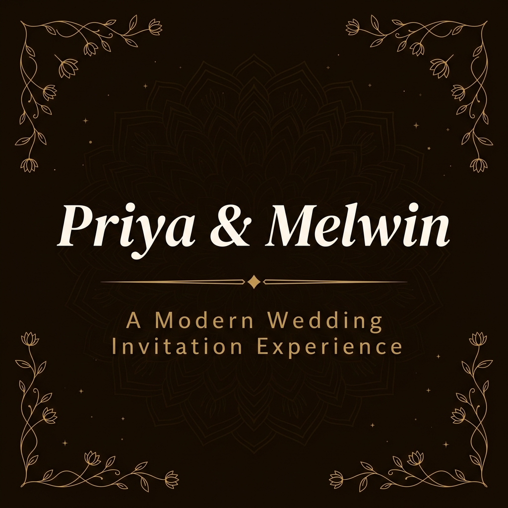

<p align="center">
  
</p>

<p align="center">
  <a href="https://melwinspriya.pages.dev/" target="_blank">
    
  </a>
  &nbsp;
  
  &nbsp;
  
  &nbsp;
  
</p>

---

# Priya & Melwin — Wedding Invitation Website

A premium, fully bespoke digital wedding invitation — crafted as a single-page experience with cinematic animations, a live countdown, an events timeline, and an elegant luxury aesthetic rooted in South Asian wedding tradition.

> *"Together, at long last."*

---

## ✨ Features

| Feature | Description |
|---|---|
| **Hero Section** | Full-viewport entrance with animated couple names, floating geometric elements, and a spinning mandala |
| **Live Countdown** | Real-time days · hours · minutes · seconds countdown with a progress bar tracking the journey to the wedding date |
| **Events Timeline** | Five colour-coded ceremony cards (Sangeet, Haldi, Mehendi, Wedding, Reception) with 3-D tilt hover, shimmer effects, and per-event accent colours |
| **Family Section** | Elegant presentation of both families with ornamental dividers |
| **Venue Card** | Corner-bracket framed venue card with a Google Maps deep-link |
| **Contact Section** | One-tap phone copy button for the event coordinator's number |
| **Custom Cursor** | Gold ring + dot cursor trail with sparkle particle bursts on click (desktop only) |
| **Falling Petals** | Ambient rose-petal rain across the viewport |
| **Hashtag Strip** | Infinite-scroll marquee of the wedding hashtag `#MelWinsPriya` |
| **Scroll Reveal** | Intersection Observer driven entrance animations for every section |
| **Reduced Motion** | Full `prefers-reduced-motion` support — all animations disabled gracefully |
| **Favicon** | Custom `.ico` + multi-resolution PNGs |
| **Mobile Responsive** | Fluid layout from 320 px to 4 K |

---

## 🛠 Technology Stack

```
HTML5          — Semantic single-page structure
CSS3           — Variables, grid, flexbox, keyframe animations, media queries
Vanilla JS     — No frameworks, no dependencies, zero-bundle
```

**Fonts (Google Fonts)**

| Variable | Family | Usage |
|---|---|---|
| `--f-d` | Playfair Display | Headings, event titles, venue |
| `--f-s` | Alex Brush | Script accents (names, footer) |
| `--f-b` | DM Sans | Body copy, navigation, labels |
| `--f-h` | Sacramento | Hashtag strip, countdown intro |

**Colour Palette**

| Token | Hex | Role |
|---|---|---|
| `--bg` | `#FDFAF5` | Page background |
| `--bg-alt` | `#F7EFE3` | Alternate section background |
| `--gold` | `#B8965A` | Primary accent |
| `--gold-lt` | `#D4B483` | Light gold highlights |
| `--gold-dk` | `#8B6E3C` | Dark gold / hover |
| `--rose` | `#C4788A` | Script & hero accents |
| `--text` | `#2C1B14` | Primary text + dark sections |
| `--text-muted` | `#7A6155` | Secondary text |

---

## 🌐 Live Demo

**[melwinspriya.pages.dev](https://melwinspriya.pages.dev/)**

Hosted on **Cloudflare Pages** with global edge delivery and zero cold-start latency.

---

## 📁 Project Structure

```
melwinspriya-invitation/
├── index.html            # Complete single-page application
├── favicon.ico           # Multi-size favicon
├── favicon-16x16.png     # 16 × 16 favicon
├── favicon-32x32.png     # 32 × 32 favicon
├── server.js             # Local development server (Node.js)
├── package.json          # Dev dependencies
├── playwright.config.js  # End-to-end test configuration
├── tests/
│   └── invite.spec.js    # Playwright test suite
└── assets/
    └── readme-banner.png # Repository banner
```

---

## 💻 Local Development

**Prerequisites:** Node.js 18+

```bash
# 1. Clone the repository
git clone https://github.com/Rashmiranjantandia/melwinspriya-invitation.git
cd melwinspriya-invitation

# 2. Install dev dependencies
npm install

# 3. Start the local server
npm run dev
# → http://localhost:3000
```

---

## 🧪 Running Tests

End-to-end tests are written with [Playwright](https://playwright.dev/).

```bash
# Run the full test suite
npm test
```

---

## 🚀 Deployment

This site is deployed via **Cloudflare Pages** with automatic builds on push to `main`.

| Property | Value |
|---|---|
| Platform | Cloudflare Pages |
| Build command | *(none — static site)* |
| Output directory | `/` (repository root) |
| URL | `https://melwinspriya.pages.dev/` |

No build step is required. Cloudflare serves `index.html` directly from the repository root.

---

## 📜 License

[MIT](LICENSE)

---

<p align="center">
  Crafted with care by <strong>Rashmi Ranjan</strong><br>
  <a href="https://github.com/Rashmiranjantandia">github.com/Rashmiranjantandia</a>
</p>
